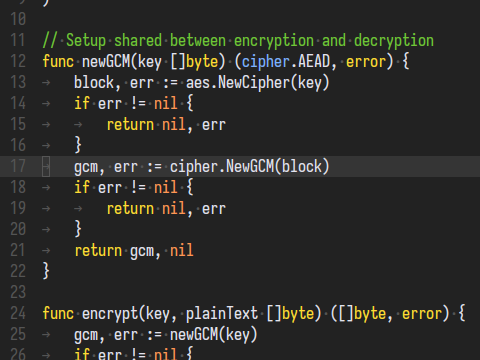
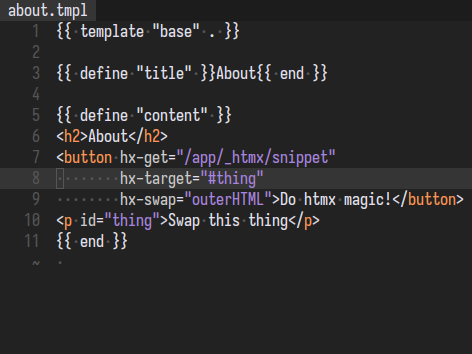

# helix-theme-one7four

Syntax theme for [helix editor](https://github.com/helix-editor/helix).
Heavily influenced by [gruber-darker](https://github.com/helix-editor/helix/blob/master/runtime/themes/gruber-darker.toml).

| Go                                        | GoHTML                                        |
|-------------------------------------------|-----------------------------------------------|
|  |  |
